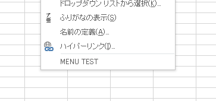

# Excel-addin-update-helper

Excel-addin-update-helper (`addIn_updat.wsf`) は、vbac.wsf 使用時のアドインの動作確認のための煩雑な作業を簡単にします。

*   アドインの更新作業を簡単にします。
*   アドインのインストールにも使えます。

# Description

vbac.wsf は、Excel アドインのソースコードを外部のエディタで編集したり git で管理したいときに大変便利なツールです。アドインのソースのインポートやエクスポートがコマンド操作だけで簡単に行うことができます。ところが、外部エディタでコード編集作業と並行してアドインの動作確認を行う場合、Excel 側で追加の操作が必要になります。

例えば編集したコードを Excel にインポートする場合。次のコマンドを実行します。
```
cscript //nologo vbac.wsf combine
```
このとき Excel が起動中の場合、アドインファイルがロックされているので更新することができません。更新するには Excel のアドインマネージャからアドインを一時的に無効にするか、いちど Excel を終了する必要があります。その後
```
cscript //nologo vbac.wsf combine
```
を実行するとアドインを更新できます。続いてアドインの動作確認をするには、一時的に無効にしたアドインを再度有効にするか、終了していた Excel を起動します。はじめから Excel の IDE でコード編集を行えば、このような追加操作は必要無いのですが。せっかく外部エディタを使えるのですから解決したい問題です。この Excel-addin-update-helper を併用すれば煩雑な操作をもう少し簡単にしてくれます。


# Usage

## ファイル配置について

サンプルが無いとわかりにくいので、ダミーのアドインファイル`demo_sample.xlam`を用いて説明しています。実際の使用には役立たないので確認後は削除してください。

```
./
|- addIn_updat.wsf          <= Excel-addin-update-helper 本体
|- export_addin.cmd         <= エクスポートコマンド
|- import_addin.cmd         <= インポートコマンド
|- README.md                <= このファイル
|- vbac.wsf                 <= vbac ツール本体
|                           (Github - Ariawase written by @igeta)
|
|
+- /bin                     <= アドインファイル配置フォルダ
|   |- demo_sample.xlam     <= ターゲットのアドインファイル
|
+- /src                     <= ソースファイル展開フォルダ
    +- /demo_sample.xlam    <= アドイン名のフォルダ
        |- context_menu.bas <=    展開されたソースファイル
        |- ThisWorkbook.dcm <=    展開されたソースファイル
```

*   はじめに、ターゲットのアドインファイルを`bin`フォルダの中に（複数可）配置します。今はダミーのアドインファイル`demo_sample.xlam`が配置されているはずです。


## アドインをエクスポート

エクスポートコマンドは、アドインのソースファイルを展開します。こちらは vbac.wsf のコマンドをそのまま実行していますので、使い方は vbac.wsf に準じます。`export_addin.cmd`をダブルクリックするか、コマンドラインから実行しても同じです。

`export_addin.cmd`
```
cscript //nologo vbac.wsf decombine
```
このコマンドは、ローカルフォルダ`\bin`のアドインファイルをエクスポートします。ユーザーアドインフォルダ`(%USERPROFILE%/AppData/Roaming/Microsoft/AddIns)`にインストールしたアドインはエクスポートされませんので注意してください。

アドインをエクスポートすると、`\src`フォルダの中にアドイン名のフォルダが作成されます。このときアドインが複数在る場合は、それぞれのアドイン名のフォルダが作成されます。各フォルダの中にソースファイルが展開され、既にファイルが存在する場合は上書きされます。また、ソースファイルをお気に入りのエディタで編集することができますが、エンコード形式は`SHIFT-JIS`（VBAの仕様）なので注意してください。


## アドインをインポート

インポートコマンドは、編集が終わったソースファイルを再び元のアドインに取り込みます。このコマンドは Excel-addin-update-helper の本体`addIn_updat.wsf`を実行しています。`import_addin.cmd`をダブルクリックするか、コマンドラインから実行しても同じです。**Excel の実行中にかかわらずインポートが可能なのが特徴です。**

`import_addin.cmd`
```
cscript //nologo addIn_updat.wsf
```
このときアドインがインストール前の場合は、アドインを Excel にインストールします。デフォルトではローカルフォルダ`\bin`のアドインファイルを Excel が参照します。また、このフォルダは addIn_updat.wsf の`ADDIN_PATH`で指定できます。

アドインのインストール先としてExcel のユーザーアドインフォルダ`(%USERPROFILE%/AppData/Roaming/Microsoft/AddIns)`へのインストールも可能ですが、 vbac.wsf の管理下に置けず容易にエクスポートできないのでお勧めしません。

ここまでの手順で、サンプルのアドイン`demo_sample.xlam`のインポートが完了すれば Excel のコンテキストメニューに新しいメニュー`MENU TEST`が追加されているでしょう。



これを削除するには、アドインファイル`demo_sample.xlam`を削除後 Excel のアドインマネージャを開きアドイン名`Demo sample`を無効にします。


以上のように Excel-addin-update-helper (`addIn_updat.wsf`) を使うことで、次のように 1-2-3-1-2-3..... のような流れになり、アドイン開発作業が少し楽になります。

1.  コード編集と git で管理。
2.  Excel にインポート (`import_addin.cmd`)
3.  Excel で動作確認とデバッグ


# License

MIT

vbac.wsf のライセンスは https://github.com/vbaidiot/Ariawase#license です。作者のigeta氏に感謝いたします。